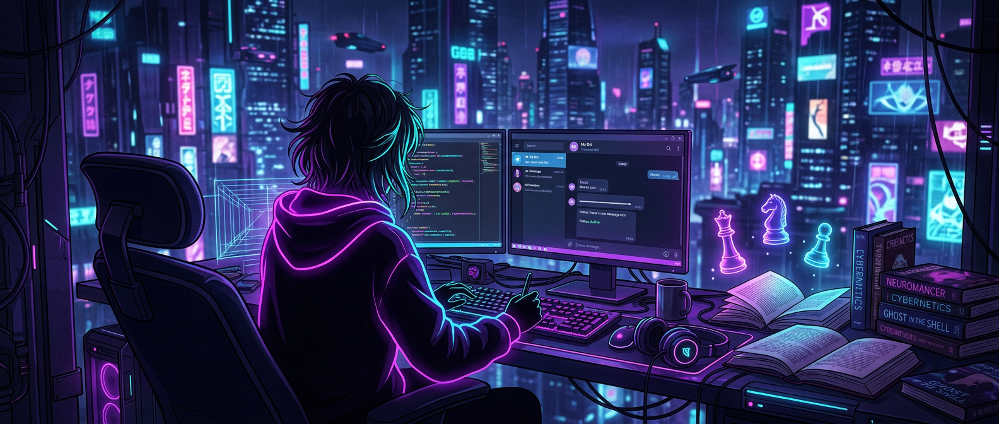
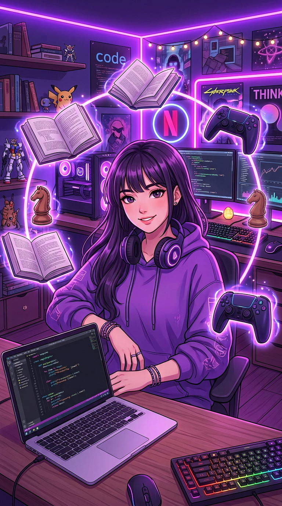

<!--- IAMRITA • Profile README • Logic Over Emotions --->

<!-- ═══════════ ANIMATED HEADER ═══════════ -->


<!-- ═══════════ TYPING ANIMATION ═══════════ -->
<p align="center">
  <a href="https://github.com/iamrita-ai"></a>
</p>

<!-- ═══════════ BADGES ═══════════ -->
<p align="center">
  
  <a href="https://github.com/iamrita-ai?tab=followers"></a>
  <a href="https://github.com/iamrita-ai?tab=repositories"></a>
</p>

<p align="center">
  
  
  
</p>

<!-- ═══════════ AI-GENERATED BANNER ═══════════ -->
<p align="center">
  
</p>

<!-- ═══════════ VIDEO INTRO ═══════════ -->
<h2 align="center">🎬 Motion Intro <sub><sup>(press play)</sup></sub></h2>

<p align="center">
  <video autoplay="autoplay" muted="muted" loop="loop" playsinline controls width="100%" poster="assets/banner.png">
    <source src="https://raw.githubusercontent.com/iamrita-ai/iamrita-ai/main/assets/showcase.mp4" type="video/mp4"/>
  </video>
</p>

<p align="center">
  <a href="https://raw.githubusercontent.com/iamrita-ai/iamrita-ai/main/assets/showcase.mp4" title="Watch full video">
    
  </a>
  <br/>
  <sub>👆 <a href="https://raw.githubusercontent.com/iamrita-ai/iamrita-ai/main/assets/showcase.mp4">Watch in HD</a> • AI-generated art + motion intro, made for this profile 🎨</sub>
</p>

---

<table>
  <tr>
    <td width="62%" valign="top">

## 🧠 About Me — `whoami`

```python
rita = Developer(
    name="IAMRITA",
    role="Telegram Bot Developer",
    thinking="rational // no sugar-coating",
    emotions="disabled",
    logic="always_on",
    hobbies=["novels", "self_dev_books",
             "netflix", "telegram_bots",
             "video_games", "chess"],
)
print(rita.motto())
# >>> "Logic over Emotions. Truth over Comfort."
```

- 🤖 I build **Telegram bots** — downloaders, automation, AI chat, music, book bots & more
- 📚 Reader of **novels + self-development books** — I learn, then I build
- ♟️ **Chess player** — every commit is a calculated move
- 🎮 Gamer • 🎬 Netflix enjoyer • ⚡ Automation-obsessed
- 🧊 I think **rationally, without sugar-coating** — logic, no emotions

    </td>
    <td width="38%" valign="top" align="center">
      
      <br/>
      <sub><i>✨ My digital self — AI generated ✨</i></sub>
      <br/><br/>
      <a href="https://t.me/TechnicalSerena"></a>
      <br/>
      <a href="https://t.me/Xioqui_xin"></a>
    </td>
  </tr>
</table>

---

<!-- ═══════════ ANIMATED PHILOSOPHY QUOTES ═══════════ -->
<h2 align="center">⚡ My Operating System</h2>

<p align="center">
  <a href="https://github.com/iamrita-ai"></a>
</p>

> 🧊 *"I don't think with emotions. I think with logic. No sugar-coating — reality, compiled and executed."* — **IAMRITA**

---

## 🛠️ Tech Stack & Arsenal

<p align="center">
  
  
  
  
</p>
<p align="center">
  
  
  
  
</p>
<p align="center">
  
  
  
  
  
</p>

---

## 🎯 Hobbies — Beyond the Code

| Hobby | Vibe | Badge |
|:------|:-----|:------|
| 📖 **Novels** | Lost in stories, found in ideas |  |
| 📈 **Self-Development Books** | Upgrade the mind, then the code |  |
| 🎬 **Netflix** | Recharge mode: ON |  |
| 🤖 **Telegram Bots** | If it's manual, I'll automate it |  |
| 🎮 **Video Games** | Strategy + reflexes training |  |
| ♟️ **Chess** | Life is chess — calculate everything |  |

---

## 🔗 Connect Hub — One Click Redirects

<p align="center"><i>Every badge below is redirectable — click to land directly in my world 🚀</i></p>

<p align="center">
  <a href="https://t.me/TechnicalSerena"></a>
  <a href="https://t.me/Xioqui_xin"></a>
</p>
<p align="center">
  <a href="https://t.me/serenaunzipbot"></a>
  <a href="https://github.com/iamrita-ai"></a>
</p>

---

## 📊 GitHub Stats — The Receipts

<p align="center">
  
  
</p>
<p align="center">
  
  
</p>
<p align="center">
  
</p>

---

## 🔥 Featured Projects

<p align="center">
  <a href="https://github.com/iamrita-ai/SERENA-UNZIP"></a>
  <a href="https://github.com/iamrita-ai/Terabox-Drive"></a>
</p>
<p align="center">
  <a href="https://github.com/iamrita-ai/Books"></a>
  <a href="https://github.com/iamrita-ai/telegram-ai-autoreply"></a>
</p>
<p align="center">
  <a href="https://github.com/iamrita-ai/advanced-telegram-bot"></a>
  <a href="https://github.com/iamrita-ai/SERNA-Spotify-"></a>
</p>

<p align="center">
  <a href="https://github.com/iamrita-ai?tab=repositories"></a>
</p>

---

## 💭 Daily Fuel — Random Wisdom

<p align="center">
  
</p>

---

## 🐍 Contribution Snake — Watch It Eat My Code

<p align="center">
  
</p>

---

<p align="center">
  <a href="https://github.com/iamrita-ai"></a>
</p>


<p align="center"><sub>© 2026 IAMRITA • Crafted with logic, zero emotions • 🎨 AI art + 🎬 motion intro generated for this profile</sub></p>
